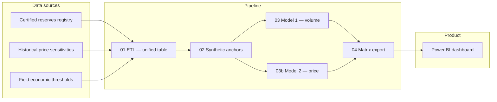

# Reserves-vs-Price Surrogate Model

A reproducible ML pipeline that estimates how a large oil & gas reserves portfolio would
respond to changes in the reference market price, and serves that answer in seconds through
an interactive Power BI dashboard.

**This is a portfolio project.** The organization it was built for, and every field name,
volume, price and breakeven figure, have been removed from this public repository — only the
methodology, the pipeline code, the test suite, and the engineering decision record are here.
See [Data & privacy](#data--privacy) below for the exact boundary.

## The problem

Investment decisions over a large asset portfolio often need to answer: *how much
economically viable reserve inventory survives if the reference price moves?* The official
systems that compute that sensitivity with full rigor can take days of specialist work per
scenario. Markets move in hours. This pipeline closes that gap with a **surrogate model**: it
learns the price → volume response from sensitivities the official systems already produced,
and replays that response instantly for any price the user asks about.

**It does not replace the official reserves-certification or planning systems.** It is
internal analytical support that sits downstream of them, trained only on their already-audited
outputs, and it never invents volume that wasn't already certified.

| It is **not**… | Because… |
|---|---|
| A replacement for the official reserves registry | It only re-anchors to already-certified values |
| A forecast of the market price | Price is a user **input** (scenario), not an output |
| One global model for the whole portfolio | Each field gets its own estimator — real heterogeneity |
| An ungoverned black box | Non-regression tests, confidence labels, explicit promotion gates |

## Architecture



Inference composition per field:

```text
market price  →  (Model 2)  →  realized field price  →  (Model 1)  →  reserve volume
```

| Stage | Role |
|---|---|
| `01_etl.py` | Ingest, identity-match, unified table (parquet/CSV) |
| `02_synthetic.py` | Inject economic anchors (volume = 0 below breakeven) so the fit respects known floors |
| `03_modelo.py` (Model 1) | `volume = f(realized price)` per field — monotone, re-anchored to the certified close |
| `03b_correlacion_brent.py` (Model 2) | `realized price = g(market price)` per field — captures implicit quality/transport discounts |
| `04_pbi_export.py` | Chains market → M2 → realized price → M1 → volume; builds the BI export matrices |
| `run_pipeline.py` | Orchestrates all phases + a `production` vs `quality` (research) track + per-phase test gates |

Full architecture, the ML problem formalization, and the modeling design are in
[`docs_public/METHODOLOGY.md`](docs_public/METHODOLOGY.md).

## Running it

```bash
pip install -r requirements.txt
python run_pipeline.py           # production track, all 7 phases
python run_pipeline.py --calidad # research track (isolated staging/results)
pytest tests/ -q                 # per-phase gates + the frozen non-regression contract
```

The pipeline needs input data it does not ship with (see next section) — without it,
`run_pipeline.py` will fail at the ETL phase. `pytest tests/` alone still exercises the
synthetic-fixture tests that don't require real data.

## Data & privacy

**No proprietary data is in this repository.** `.gitignore` excludes the entire `datos/` (raw
inputs) and `resultados/` (pipeline outputs) trees, and the internal `docs/` folder that holds
the numeric decision log. What a fork needs to supply, and the exact schema each input file
must satisfy (sheet names, header rows, column names, known parsing traps), is documented —
**with no real values** — in [`docs_public/DATA_CONTRACT.md`](docs_public/DATA_CONTRACT.md).

Every tracked file in this repo was reviewed before publishing. Field names appear in the code
and tests (they're public record in the source jurisdiction's regulatory filings), but no
per-field volume, price, or breakeven number does. Test fixtures using synthetic data are
unaffected; the handful of tests that compared against real production figures now import an
optional, gitignored `tests/valores_locales.py` and skip cleanly without it.

## Methodology, governance & difficulties

- [`docs_public/METHODOLOGY.md`](docs_public/METHODOLOGY.md) — the two chained models, the
  hard invariants (monotonicity, hard floor, re-anchoring, prudent ceiling), why generic
  regressors were rejected as the primary engine, and how uncertainty bands are built.
- [`docs_public/GOVERNANCE.md`](docs_public/GOVERNANCE.md) — the non-regression contract
  (physical / statistical / frozen-baseline / rolling-backtest / label-stability gates), the
  `production` vs `quality` two-track scheme, and the promotion rule between them.
- [`docs_public/DIFFICULTIES.md`](docs_public/DIFFICULTIES.md) — the honest engineering
  record: the price↔recertification confound (the flagship finding), the structurally
  negative R² in a narrow price band, an experiment that was run and **rejected**, a bug that
  a skipped test suite let through, and why portfolio uncertainty bands are combined in
  quadrature instead of summed.

## Repo map

```
├── 01_etl.py … 04_pbi_export.py   pipeline phases
├── motores_modelo1.py             candidate 1-D engines for Model 1
├── m2_familias.py                 candidate families for Model 2
├── run_pipeline.py                orchestration + tracks + gates
├── tests/, tests_calidad/         pytest gates (per-phase + non-regression contract)
├── Tablero/                       Power BI report definition (PBIP/TMDL)
├── docs_public/                   this documentation, in English, aggregate figures only
└── docs/, datos/, resultados/     gitignored — internal, not published
```

## Stack

```text
Python · pandas · NumPy · scikit-learn · SciPy · matplotlib
pytest · joblib · parquet
Power BI (PBIP / TMDL) · DAX
```

## License

MIT — see [LICENSE](LICENSE).
